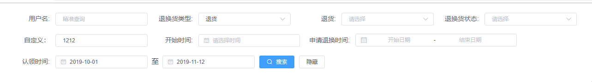

# vue_houtai

## Project setup
```
npm install
```

### 运行demo

```
npm run mock
```

### Compiles and hot-reloads for development
```
npm run dev
```

### Compiles and minifies for production
```
npm run build
```

### Run your tests
```
npm run test
```

### Lints and fixes files
```
npm run lint
```

# vue_component

后台管理系统里面table表格跟查询条件的公共组件

项目模板
全局安装：npm install fanscky-template-cli -g
创建项目：fanscky-cli init xx(项目名字)

## 组件使用

npm install vue-fanscc-table -S-d

### main.js

```javascript
import vueFansckyTable from "vue-fanscky-table";
import "vue-fanscky-table/lib/vue-fanscc-table.css";
Vue.use(vueFansckyTable);
// 组件内使用
<template>
  <div class="remittanceInformation">
    <searchDom
      :search-from="searchFrom"
      v-model="valueClone"
      style="margin-top:20px;"
    >
      <el-button type="primary" @click="search()">查询</el-button>
    </searchDom>
    <div></div>
    <tableDom
      :realTableColumns="realTableColumns"
      :value-clone="valueClone"
      ref="tableCommon"
      path="/account"
      @childmethods_out="childmethods_out"
    ></tableDom>
  </div>
</template>

<script>
import { layout } from "./ckytext.js";

export default {
  name: "userManagement",
  data() {
    return {
      valueClone: {},
      searchFrom: layout.searchFrom,
      realTableColumns: layout.realTableColumns
    };
  },
  methods: {
    childmethods_out() {},
    search() {
      this.$refs.tableCommon.pageIndex = 1;
      this.$refs.tableCommon.init(this.valueClone);
    }
  }
};
</script>
```


# searchDom搜索公共组件

> 用于配置table上的查询条件的公用组件

## 使用方法

```HTML
 <searchDom
      v-model="valueClone"
      :search-from="searchFrom"
      staticParams={id: 1}
      methodRequest="get"
      labelWidth="110px"
      path="/select"
      style="margin-top:20px;"
    >
    // 自定义查询框,没自定义的时候template内容可以去掉
      <template slot="selfdingyi" slot-scope="scope">
        <el-form-item
          :label="scope.data.title + '：'"
          :label-width="scope.data.labelWidth"
        >
          <el-input
            style="width: 200px"
            v-model="valueClone[scope.data.name]"
            placeholder="请输入内容"
          ></el-input>
        </el-form-item>
      </template>
      <el-button type="primary" icon="el-icon-search" @click="search">
        搜索
      </el-button>
    </searchDom>
```    
### searchDom Attributes

| 参数 | 说明 | 类型 | 可选值 | 默认值 |  
| :-:| :-: | :-: |:-: | :-: |
| path | 下拉框请求接口 | String | - | - |  
| labelWidth | 输入框前面的文字描述宽度 | String | - | 80px |
| methodRequest | 下拉框请求方法 | String | - | get |

### searchFrom Attributes

配置的一段json来实现不同的json渲染出不同的组件例子如下：

```javascript
 // 搜索的样式
  searchFrom: [
    {
      inputModel: "fsInput", 
      title: "用户名",        
      name: "username", 
      placeholder: "精准查询"  
    },
    {
      inputModel: "fsSelect",
      title: "退换货类型",
      placeholder: "请选择",
      name: "orderType",
      value: "0",
      staticArr: [
        { label: "退货", value: "0" },
        { label: "换货", value: "1" }
      ],
      defaultArr: true
    },
    {
      inputModel: "fsSelect",
      title: "退货",
      placeholder: "请选择",
      name: "orderStatusList1",
      mapName: "退货",
      paramsMaping: {
        label: "desc",
        value: "type"
      }
    },
    {
      inputModel: "fsSelect",
      title: "退换货状态",
      placeholder: "请选择",
      multiple: true,
      name: "orderStatusList",
      value: [],
      mapName: "退换货状态",
      paramsMaping: {
        label: "desc",
        value: "type"
      }
    },
     {
      inputModel: "fsSelect",
      title: "省",
      placeholder: "请选择",
      multiple: true,
      name: "provide",
      mapName: "省",
      sublevel: "city",
      paramsMaping: {
        label: "desc",
        value: "type"
      }
    },
    {
      inputModel: "fsSelect",
      title: "市",
      placeholder: "请选择",
      name: "city",
      mapName: "市",
      parent: "provide",
      path: "/getCity",
      paramsMaping: {
        label: "desc",
        value: "type"
      }
    },
    {
      title: "自定义的查询",
      name: 'selfValue',
      type: "slot",
      slotName: "selfdingyi",
    },
    {
      inputModel: "fsTime",
      title: "开始时间",
      name: "stratTimeValue"
    },
    {
      inputModel: "fsDoubleTime",
      title: "申请退换时间",
      name: "retrunTimeValue",
      value: ["", ""],
      labelWidth: "120px"
    },
    {
      inputModel: "fsmultiTime",
      title: "认领时间",
      name: "claimTime",
      placeholder: "请选择",
      lastFirstToToday: true
    }
  ],
```
> ### 通用参数 

| 参数 | 说明 | 类型 | 可选值 | 默认值 |  
| :-:| :-: | :-: |:-: | :-: |
| inputModel | 输入框的类型,支持input输入框<br>select下拉框单个时间与时间区间 | String | fsInput,fsSelect,<br>fsTime,fsDoubleTime,fsmultiTime | - | 
| title | 输入框前面的文字描述 | String | - | - |
| name | 对应传给后台的参数 | String | - | - |
| value | 设置输入框的默认值<br>注：时间区间与下拉框多选是数组 | String | - | - |
| labelWidth | 控制自身输入框前文字的宽度 | String | - | 80px |
| clearable | 有内容的时候支持点击清空 | Boolean | - | true |

---

> ### input输入框自身参数配置  

无

-----

> ### select下拉框自身参数配置

| 参数 | 说明 | 类型 | 可选值 | 默认值 |  
| :-:| :-: | :-: |:-: | :-: |
| multiple | 是否支持是多选 | Boolean | true,false | false | 
| mapName | 后台返回的下拉框数据对应的key<br>如返回{a:[],b:[]};a对应一个下拉框的值b对应另外一个下拉框,这里的a就是mapName对应的配置字段 | String | - | - |
| paramsMaping | 用于转换后台返回的下拉框的字段如返回a:[{desc:cc,type:1},只需配置paramsMaping：{label: "desc", value: "type"}] | Object | - | null |
| staticArr | 使用自己写死的下拉框的值如staticArr: [{ label: "退货", value: "0" }, { label: "换货", value: "1" }]需与defaultArr配合使用, | Array | - | - |
| defaultArr | 是否用自己写死的下拉框需与staticArr配合使用 | Boolean | - | false |
| sublevel | 联动下拉框下级与后台对应的字段名,如省市联动对应市的字段名,需与parent联合起来使用 | Boolean | - | false |
| parent | 联动下拉框上级与后台对应的字段名,如省市联动对应省的字段名,需与sublevel联合起来使用 | Boolean | - | false |
| staticParams | 下拉框请求的默认参数 | Object | - | {} |
| path | 此下拉框对应的接口请求路径 | String | - | - |

---

> ### fsTime时间自身参数配置

| 参数 | 说明 | 类型 | 可选值 | 默认值 |  
| :-:| :-: | :-: |:-: | :-: |
| dateType | 时间显示类型 | String | date,dateTime。data显示yyyy 年 MM 月 dd 日dataTime显示yyyy 年 MM 月 dd 日 HH时：mm分：ss秒 | date | 
| valueFormat | 可选,绑定值的格式。不指定则绑定值为 Date 对象 | String | - | yyyy-MM-dd |
| disabled | 是否可以编辑 | Boolean | - | false |

---

> ### fsDoubleTime区间时间参数配置

| 参数 | 说明 | 类型 | 可选值 | 默认值 |  
| :-:| :-: | :-: |:-: | :-: |
| dateType | 时间显示类型 | String | year/month/date/week/ datetime/datetimerange/daterange | daterange | 
| format | 可选,绑定值的格式。不指定则绑定值为 Date 对象 | String | - | yyyy-MM-dd HH:mm:ss |
| disabled | 是否可以编辑 | Boolean | - | false |
| startPlaceholder | 开始时间的默认显示提示信息 | String | - | 开始日期 |
| endPlaceholder | 结束时间的默认显示提示信息 | String | - | 结束日期 |

> ### fsmultiTime组合时间区间参数配置

| 参数 | 说明 | 类型 | 可选值 | 默认值 |  
| :-:| :-: | :-: |:-: | :-: |
| format | 可选,绑定值的格式。不指定则绑定值为 Date 对象,时间类型也由此值的长度决定长度为7对应month类型,大于7小于12为date类型其他为datetime类型 | String | - | yyyy-MM-dd |
| lastAllMonth | 默认值为上月全月 | Boolean | - | false |
| lastFirstToToday | 默认值为上月第一天到今天 | Boolean | - | false |
| before | 代表结束日期是当前日期,开始日期是由当前日期减timeLag,需与timeLag配合使用 | Boolean | - | false |
| after | 代表开始时间是当前日期,结束日期是由开始日期算出来的,由开始日期加上timeLag,需与timeLag配合使用 | Boolean | - | false |
| timeLag | 代表默认的开始时间跟结束时间相隔多少 | Number | - | 2592000000(30天) |
| disabled | 是否可以编辑 | Boolean | - | false |
 
---

> ### 自定义查询参数配置

| 参数 | 说明 | 类型 | 可选值 | 默认值 |  
| :-:| :-: | :-: |:-: | :-: |
| type | slot代表此输入框自定义 | String | slot | - |
| slotName | 控制自定义输入框的位子 | String | - | - |

# <font color='red'> 注意：</font>
  * 此组件依赖element-ui,跟axios 
  * 下拉框判断请求成功与否需要后台返回success字段true成功false失败，返回的下拉框数组参数需要在model里面 获取下拉框的请求如下：
```javascript
.then(res => {
  if (res.success) {
    if (this.mapData) {
      this.dealData(res.model[this.mapData]);
    } else if (res.code === undefined) {
      this.dealData(res);
    } else {
      this.dealData(res.model);
    }
  }
});

dealData方法无需理会,我们需要的参数需要在res.model里面
```


> ### 查询组件searchDom展示



# table表格分页公用组件

> 用于配置table显示与查询,分页公共组件

## 使用方法

```HTML
  <!-- 表格 -->
  <tableDom
    ref="tableCommon"
    path="/mock_autoTreasure"
    totalPath="/totalPath"
    :totalRowMap="{money: moneyTotal}"
    totalFormatterType ="thousandMark"
    :paginationShow="true"
    request_method="post"
    :table_control="true"
    :real-table-columns="realTableColumns"
    @childmethods_out="childmethods_out"
  />

  <!-- 自定义表头跟自定义列 也可以只自定义表头跟自定义列-->
    <tableDom
      ref="tableCommon"
      path="/mock_autoTreasure"
      request_method="post"
      :table_control="true"
      :real-table-columns="realTableColumns"
      @childmethods_out="childmethods_out"
    >
      <template slot="userCode" slot-scope="scopeHeader">
        <el-table-column align="right">
          <template slot="header">
            <el-tooltip content="详细提示信息" placement="top">
              <span style="text-align: center;display:inline-block;width: 100%"
                >{{ scopeHeader.data.title }}<i class="el-icon-question"></i
              ></span>
            </el-tooltip>
          </template>
          <template slot-scope="scope">
            <span>{{ scope.row[scopeHeader.data.name] }}</span>
          </template>
        </el-table-column>
      </template>
    </tableDom>
```
### tableDom Attributes

| 参数 | 说明 | 类型 | 可选值 | 默认值 |  
| :-:| :-: | :-: |:-: | :-: |
| path | 列表请求的后台接口 | String | - | - |  
| totalPath | 合计行请求后台接口 | String | - | - |
| totalRowMap | 合计行控制那些列显示合计行对象里面的键名对应列表当前列对应的字段,键值对应合计行返回的参数字段 | Object | - | get |
| totalFormatterType | 合计行显示的格式 | Sting | thousandMark(千分符) | - |
| paginationShow | 是否显示分页组件 | Boolean | - | true |
| request_method | 请求列表接口的方法 | Sting | get,post | get |
| table_control | 是否显示控制动态表格表头的组件 | Boolean | - | true |
| spanMethod | 合并表格的方法参考elementUI合并表格方法 | Function | - | - |
| beforeSearch | 请求列表数据的之前的方法 | Function(pramas, done){done(newPramas)};pramas为查询参数,newPramas为处理后的参数 | - | - |

---

### realTableColumns Js数组

```javascript
 // 表格样式
  realTableColumns: [
    // 配置表格
    {
      title: "#",
      width: "55",
      ishidden: true,
      type: "selection"
    },
    {
      title: "序号",
      width: "55",
      ishidden: true,
      type: "index"
    },
    {
      name: "orgName",
      title: "用户编号",
      iconName: "el-icon-question",
      tooltipContent: "你好,这是详细的描述"
    },
    {
      name: "provinceName",
      type: "dialog",
      isShowClick: function(row) {
        if (row.status) return true;
      },
      title: "用户名"
    },
    {
      name: "contactMobile",
      title: "电话号",
      type: "tooltip",
      width: "80"
    },
    {
      name: "balance",
      type: "formatter",
      formatterType: function(row) {
        if (row.balance === "0") {
          return "启用";
        } else {
          return "停用";
        }
      },
      title: "状态"
    },
    {
      name: "money",
      title: "金额",
      type: "formatter"
    },
    {
      name: "orgId2BalanceUpdateTimeStrMap",
      title: "时间",
      type: "multColumns",
      slotName: [
        { label: "创建人", name: "created" },
        { label: "时间", name: "orgId2BalanceUpdateTimeStrMap" }
      ]
    },
    {
      name: "active",
      title: "操作",
      width: "180",
      fixed: "right",
      type: "button",
      buttons: [
        // 配置操作栏
        {
          name: "编辑",
          event: {
            type: "routerMethod",
            params: ["status", "orgName"],
            url: "/edit"
          }
        },
        {
          name: "删除",
          typeIcon: "danger",
          isShow: function(index, row) {
            if (row.status === 1) {
              return true;
            } else {
              return false;
            }
          },
          event: {
            type: "delete",
            params: ["status", "orgName"],
            request_method: "post",
            url: "/mock_autoTreasure"
          }
        }
      ]
    }
  ]
```
---

> ### 通用参数 

| 参数 | 说明 | 类型 | 可选值 | 默认值 |  
| :-:| :-: | :-: |:-: | :-: |
| title | 表头文字 | String | - | - | 
| width | 当前列的宽度不配置则自适应宽度 | String | - | - |
| ishidden | 动态控制表头的时候是否需要配置true则表示当前列必显示,与table_control关联使用 | Boolean | - | false |
| type | 控制列的类型 | String | selection,<br>index,dialog,<br>tooltip,<br>formatter<br>button,multColumns | - |
| isShowClick | 当type=dialog,isShowClick用来判断是否点击出现弹窗返回true则可以点击出现弹窗 | Function(row){if (row.status === 1){return true}else {return false}} | - | - |
| iconName | 表头鼠标滑过出现提示信息的icon | String | - | - |
| tooltipContent | 表头鼠标滑过出现提示信息文字 | String | - | - |
| formatterType | 当type=formatter是配置的过滤的方法,不配置则默认是做千分符过滤 | Function(row){if (row.status === 1) {return '启动'}else {return '停用'}} | - | - |
| slotName | 当type=multColumns当前列显示几行slotName没一项代表一行 | Array | - | - |

----

> ### type=button时配置操作栏buttons对象参数配置

| 参数 | 说明 | 类型 | 可选值 | 默认值 |  
| :-:| :-: | :-: |:-: | :-: |
| name | 操作栏里面的按钮的文字 | String | - | - | 
| typeIcon | 操作栏按钮的风格参考elementUi button按钮type | String | - | primary | 
| isShow | 操作栏按钮是否显示返回true显示否则不显示 | Function(index, row) {if (row.status ===1) {return true} else { return false}} | - | true |
| event.type | 配置当前按钮对应的功能 | String | routerMethod,delete(routerMethod路由跳转,delete删除当前列)。支持自定义方法 | - |
| event.params | 配置方法对应的参数 | Array | - | - |
| event.request_method | 配置如果需要跟后台交付时候的方法 | String | get,post | - |
| event.url | 配置当前按钮对应的路径如果是路由跳转则对应需要跳转页面的路由地址,如果是跟后台交付的则对应的后台接口路径 | String | - | - |

---

> ### Table Methods
| 参数 | 说明 | 类型 | 可选值 | 默认值 |  
| :-:| :-: | :-: |:-: | :-: |
| childmethods_out | 接受表格里面除了delete删除跟routerMethod路由跳转外,所有按钮广播事件 | String | Function(button, val) {} button对应的button操作栏里面的配置属性,val为当前点击的行的数据 | - | 

---

# <font color='red'> 注意：</font>
  * 此组件依赖element-ui,跟axios 
  * 列表请求成功与否需要后台返回success字段true成功false失败，返回的列表数组参数需要在model.list或者model.model里面 获取列表的请求如下：
```javascript
.then(res => {
  if (res.success) {
    if (this.fliterData && typeof this.fliterData === "function") {
      this.realTableData = this.fliterData(res.model.list);
    } else {
      this.realTableData = res.model.list || res.model.model || [];
    }
    this.total = res.model.total;
    this.$nextTick(() => {
      this.$refs.tableDom.doLayout();
    });
  } 
})
```

> ### 表格展示


## 项目链接 [链接](https://fanscc.github.io/vue_table_componts/dist/index.html#/)

