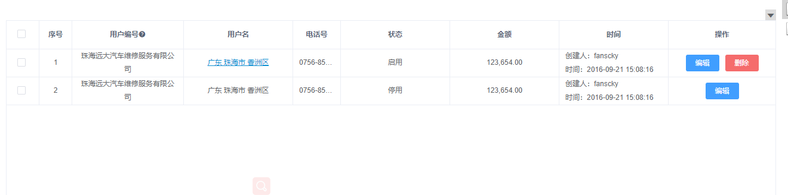
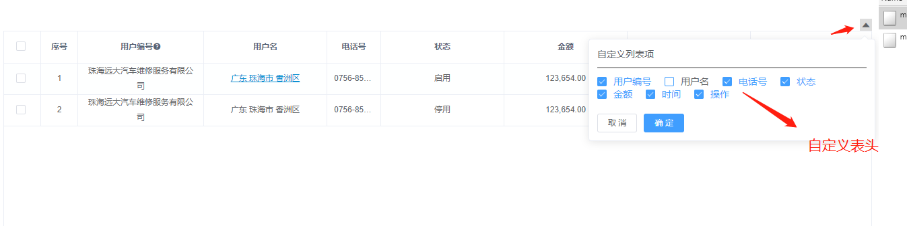

# table表格分页公用组件

> 用于配置table显示与查询,分页公共

## 使用方法

```HTML
  <!-- 表格 -->
  <tableDom
    ref="tableCommon"
    path="/mock_autoTreasure"
    totalPath="/totalPath"
    :value-clone="valueClone"
    :totalRowMap="{money: moneyTotal}"
    totalFormatterType ="thousandMark"
    :paginationShow="true"
    request_method="post"
    :table_control="true"
    :real-table-columns="realTableColumns"
    @childmethods_out="childmethods_out"
  />
```
### tableDom Attributes

| 参数 | 说明 | 类型 | 可选值 | 默认值 |  
| :-:| :-: | :-: |:-: | :-: |
| path | 列表请求的后台接口 | String | - | get |  
| totalPath | 合计行请求后台接口 | String | - | get |
| valueClone | 查询参数 | Object | - | {} |
| totalRowMap | 合计行控制那些列显示合计行对象里面的键名对应列表当前列对应的字段,键值对应合计行返回的参数字段 | Object | - | - |
| totalFormatterType | 合计行显示的格式 | Sting | thousandMark(千分符) | - |
| paginationShow | 是否显示分页组件 | Boolean | - | true |
| request_method | 请求列表接口的方法 | Sting | get,post | get |
| table_control | 是否显示控制动态表格表头的组件 | Boolean | - | true |
| spanMethod | 合并表格的方法参考elementUI合并表格方法 | Function | - | - |
| beforeSearch | 请求列表数据的之前的方法 | Function(pramas, done){done(newPramas)};pramas为查询参数,newPramas为处理后的参数 | - | - |

---

### realTableColumns Js数组

```javascript
 // 表格样式
  realTableColumns: [
    // 配置表格
    {
      title: "#",
      width: "55",
      ishidden: true,
      type: "selection"
    },
    {
      title: "序号",
      width: "55",
      ishidden: true,
      type: "index"
    },
    {
      name: "orgName",
      title: "用户编号",
      iconName: "el-icon-question",
      tooltipContent: "你好,这是详细的描述"
    },
    {
      name: "provinceName",
      type: "dialog",
      isShowClick: function(row) {
        if (row.status) return true;
      },
      title: "用户名"
    },
    {
      name: "contactMobile",
      title: "电话号",
      type: "tooltip",
      width: "80"
    },
    {
      name: "balance",
      type: "formatter",
      formatterType: function(row) {
        if (row.balance === "0") {
          return "启用";
        } else {
          return "停用";
        }
      },
      title: "状态"
    },
    {
      name: "money",
      title: "金额",
      type: "formatter"
    },
    {
      name: "orgId2BalanceUpdateTimeStrMap",
      title: "时间",
      type: "multColumns",
      slotName: [
        { label: "创建人", name: "created" },
        { label: "时间", name: "orgId2BalanceUpdateTimeStrMap" }
      ]
    },
    {
      name: "active",
      title: "操作",
      width: "180",
      fixed: "right",
      type: "button",
      buttons: [
        // 配置操作栏
        {
          name: "编辑",
          event: {
            type: "routerMethod",
            params: ["status", "orgName"],
            url: "/edit"
          }
        },
        {
          name: "删除",
          typeIcon: "danger",
          isShow: function(index, row) {
            if (row.status === 1) {
              return true;
            } else {
              return false;
            }
          },
          event: {
            type: "delete",
            params: ["status", "orgName"],
            request_method: "post",
            url: "/mock_autoTreasure"
          }
        }
      ]
    }
  ]
```
---

> ### 通用参数 

| 参数 | 说明 | 类型 | 可选值 | 默认值 |  
| :-:| :-: | :-: |:-: | :-: |
| title | 表头文字 | String | - | - | 
| width | 当前列的宽度不配置则自适应宽度 | String | - | - |
| ishidden | 动态控制表头的时候是否需要配置true则表示当前列必显示,与table_control关联使用 | Boolean | - | false |
| type | 控制列的类型 | String | selection,<br>index,dialog,<br>tooltip,<br>formatter<br>button,multColumns | - |
| isShowClick | 当type=dialog,isShowClick用来判断是否点击出现弹窗返回true则可以点击出现弹窗 | Function(row){if (row.status === 1){return true}else {return false}} | - | - |
| iconName | 表头鼠标滑过出现提示信息的icon | String | - | - |
| tooltipContent | 表头鼠标滑过出现提示信息文字 | String | - | - |
| formatterType | 当type=formatter是配置的过滤的方法,不配置则默认是做千分符过滤 | Function(row){if (row.status === 1) {return '启动'}else {return '停用'}} | - | - |
| slotName | 当type=multColumns当前列显示几行slotName没一项代表一行 | Array | - | - |

----

> ### type=button时配置操作栏buttons对象参数配置

| 参数 | 说明 | 类型 | 可选值 | 默认值 |  
| :-:| :-: | :-: |:-: | :-: |
| name | 操作栏里面的按钮的文字 | String | - | - | 
| typeIcon | 操作栏按钮的风格参考elementUi button按钮type | String | - | primary | 
| isShow | 操作栏按钮是否显示返回true显示否则不显示 | Function(index, row) {if (row.status ===1) {return true} else { return false}} | - | true |
| event.type | 配置当前按钮对应的功能 | String | routerMethod,delete(routerMethod路由跳转,delete删除当前列)。支持自定义方法 | - |
| event.params | 配置方法对应的参数 | Array | - | - |
| event.request_method | 配置如果需要跟后台交付时候的方法 | String | get,post | - |
| event.url | 配置当前按钮对应的路径如果是路由跳转则对应需要跳转页面的路由地址,如果是跟后台交付的则对应的后台接口路径 | String | - | - |

---

> ### Table Methods
| 参数 | 说明 | 类型 | 可选值 | 默认值 |  
| :-:| :-: | :-: |:-: | :-: |
| childmethods_out | 接受表格里面除了delete删除跟routerMethod路由跳转外,所有按钮广播事件 | String | Function(button, val) {} button对应的button操作栏里面的配置属性,val为当前点击的行的数据 | - | 

---

# <font color='red'> 注意：</font>
  * 此组件依赖element-ui,跟axios 
  * 列表请求成功与否需要后台返回success字段true成功false失败，返回的列表数组参数需要在model.list或者model.model里面 获取列表的请求如下：
```javascript
.then(res => {
  if (res.success) {
    if (this.fliterData && typeof this.fliterData === "function") {
      this.realTableData = this.fliterData(res.model.list);
    } else {
      this.realTableData = res.model.list || res.model.model || [];
    }
    this.total = res.model.total;
    this.$nextTick(() => {
      this.$refs.tableDom.doLayout();
    });
  } 
})
```
---

> ### 表格展示




